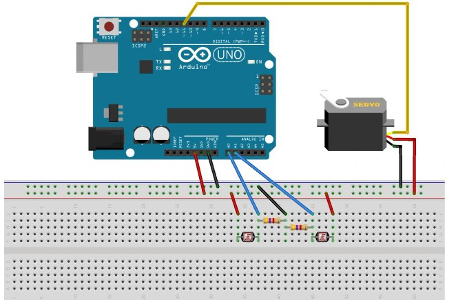

# ☀️ Solar Follower — Arduino + Servo + Photoresistors

This project is a **solar panel tracking system** using an **Arduino**, **servo motor**, and **photoresistors**.  
It automatically rotates a solar panel toward sunlight to maximize exposure.

- 🟢 **Sun Tracking** — servo moves toward the side with higher light intensity  
- 🌙 **Low-Light Reset** — servo returns to start position when overall light is low  

The full project includes **real wiring** and **Fritzing schematics**, plus a demo video.

---

## 🚀 Features
- Solar tracking with servo motor  
- Real-time adjustment based on photoresistor readings  
- Adjustable sensitivity via the `ponderation` variable  
- Serial monitor shows live sensor values  
- Works on **real hardware** with Arduino  

---

## 🔧 How It Works

- Arduino reads two photoresistors (A0 = right, A1 = left)  
- Servo rotates toward the brighter side  
- If total light is below threshold (night or shade), servo resets to start position  
- Adjustable sensitivity with `ponderation` variable  

---

## 🖼️ Project Images

### 🔌 Real Wiring  


### 🖥️ Fritzing Schematic  


---

## 📂 Project Structure

```text
solar-follower/
│── firmware/
│   └── solar_follower.ino
│
│── media/
│   ├── wiring-fritzing.png
│   ├── wiring-real.jpg
│   └── project-demo.mp4
│
│── docs/
│   ├── features.md
│   ├── system-architecture.md
│   └── components.md
│
│── README.md
```
---
## 🛠️ Technologies Used
- Arduino Uno / Nano  
- Servo motor  
- Photoresistors  
- Arduino IDE  
- C/C++  
- Breadboard & jumper wires  
- Fritzing for schematic
  
---
## 🎬 Demo

[Watch Project Demo](media/project-demo.mp4)

---
## 📧 Contact
**Manar Daghsni**  
📧 manardaghsni@gmail.com  
🔗 [LinkedIn](https://linkedin.com/in/daghsni-manar)

---

